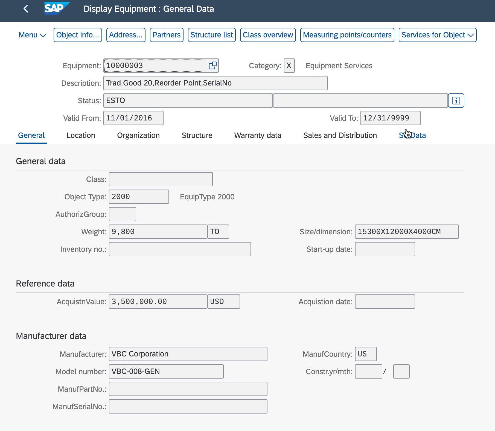
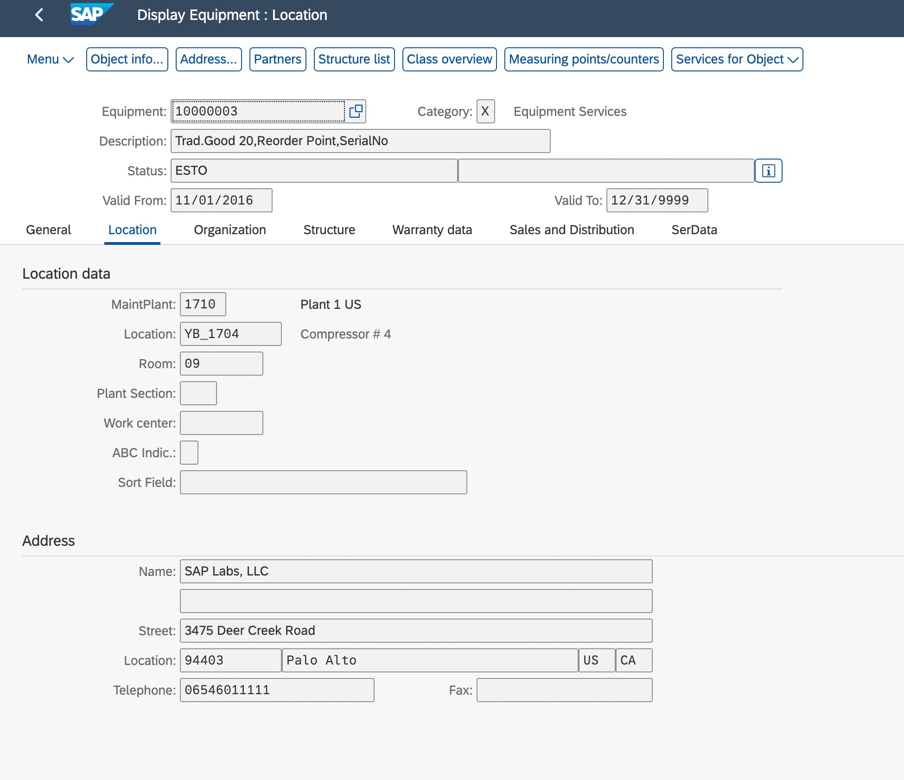
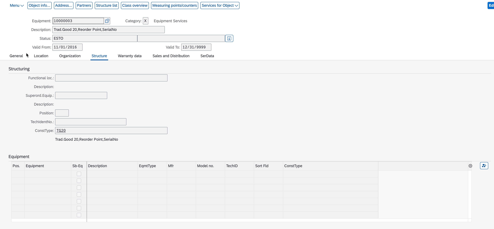
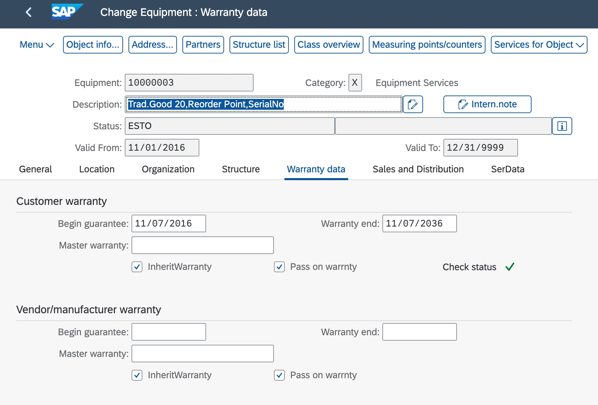
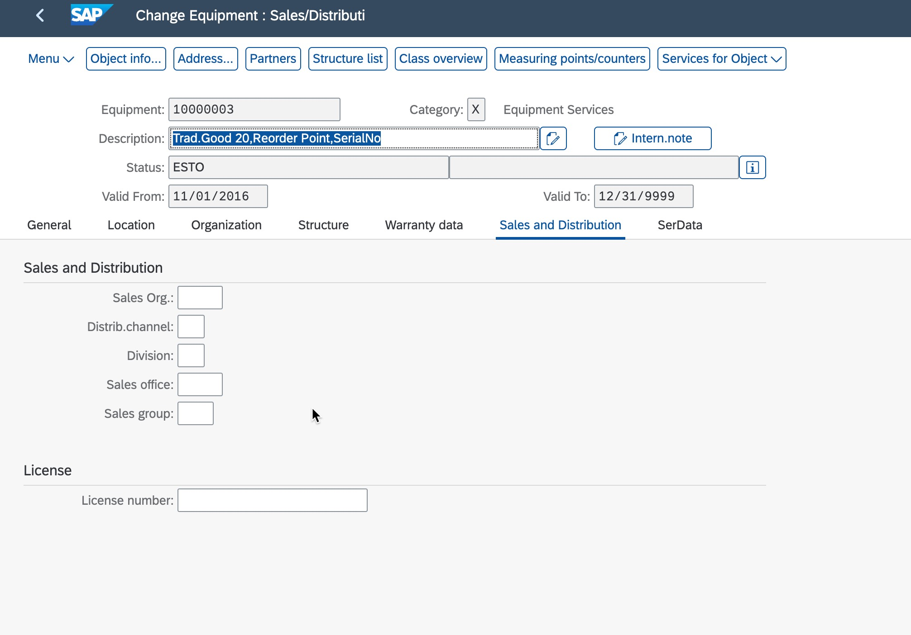
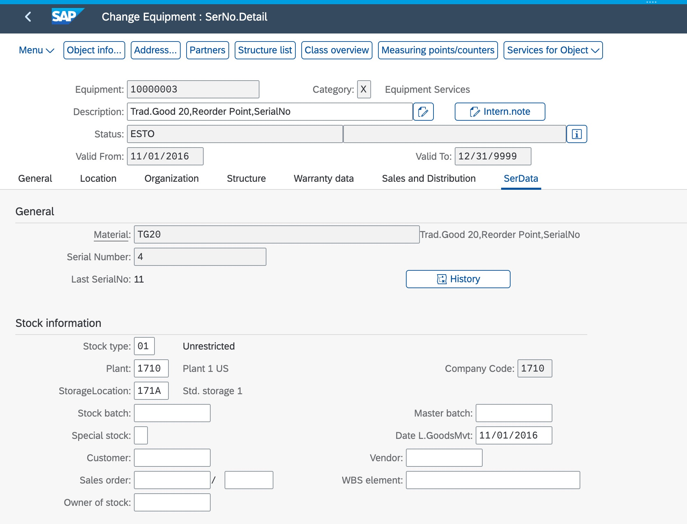

Generate an app to display and change equipment. First page should show the list of equipment records with filter field for equipment number.
Once the user selects a table record, a new page  opens up showing the data for the selected record. 
This new page MUST contain the following Tabs: General, Location, Organization, Structure, Warranty data, Sales and Distribution, SerData
It is vital that these tabs are created.
The general Tab is displayed as in the image:

Category field represents a code list with values X (Equipment services) and M (Machines)
This page also contains the following Tabs: Location, Organization, Structure, Warranty data, Sales and Distribution, SerData, each of these tabs contains fields and/or tables.
Location tab contains fields as in the image: 

Organization tab contains fields as in the image: 

Structure tab contains fields and a table listing related equipment as in the image: 

Warranty data tab contains fields as in the image: 

Sales and Distribution tab contains fields as in the image: 

SerData tab contains fields related to the general serial data and stock information as in the image: 

