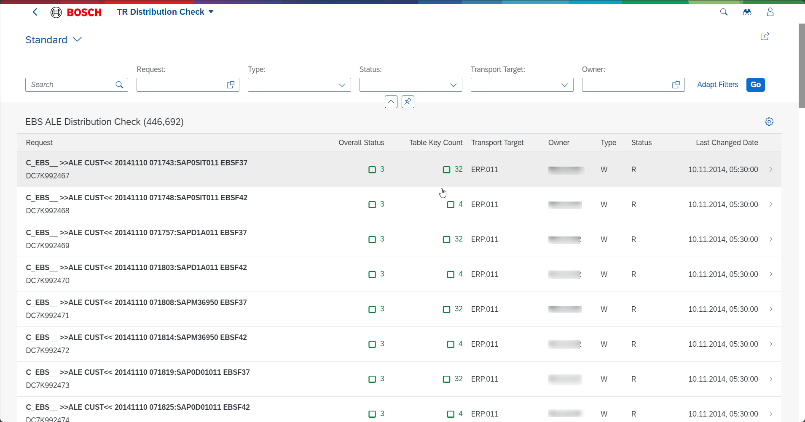
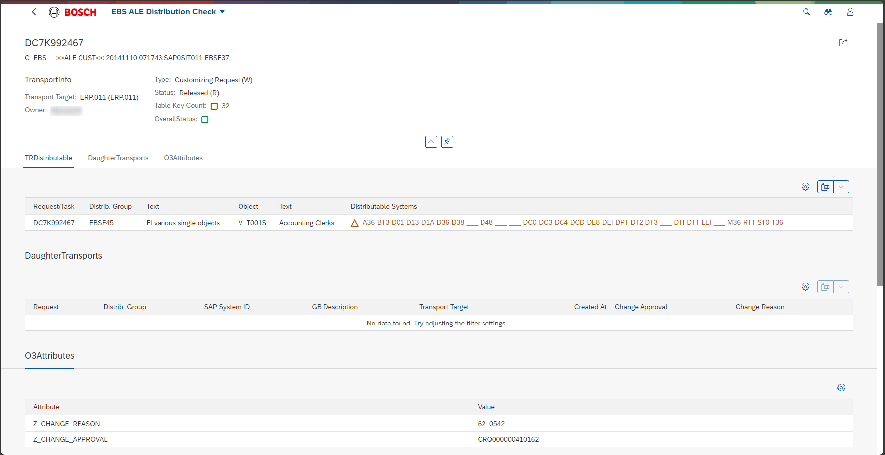

Generate an app to display transport request distribution. First page show you the list of transport requests as shown in this image . The first column in the table is the transport request ID. A transport request ID should be alphanumeric with 10 characters in length. Generate data in the format like like "DC7k992467" for transport request ID. Once the user selects a table record, a new page opens to show the data for the selected record. This page should look contain information shown in this image . This page consists of a top form section showing the detailed information about the transport request. 
